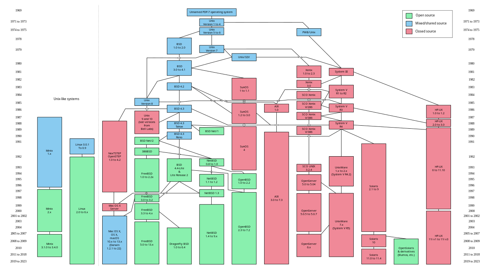

## Наконец я могу писать в README по-русски
Это русская версия потока информации что мне известна про техническую часть современных компьютеров

Буду вставлять картинки, анимации (гифки), видео и другие особенности markdown, поэтому не обещаю что эту *инструкцию* можно будет портировать на другие платформы

Можно использовать этот файл как руководство по ОС для чайников (потому что именно такой первоначальный смысл и был заложен, т.е. повышение компьютерной грамотности среди сверстников)

## (1) Верхушка

### [Программное Обеспечение](#ПО)

### [Аппаратное Обеспечение](#АО)

### [Операционная Система](#ОС)

### 4

### 5

## (2) Поверхность

### 1

### 2

### 3

### 4

### 5

## (3) Мелководье

### 1

### 2

### 3

### 4

### 5

## (4) Глубина

### 1

### 2

### 3

### 4

### 5

## (5) Дно

### 1

### 2

### 3

### 4

### 5

## (6) Бездна

### 1

### 2

### 3

### 4

### 5

Теперь перейдем к разъяснениям

## ПО
Между прочим тема 8 класса

Программное обеспечение (ПО) - набор программ, которые используются тем или иным способом при работе с компьютером (прикладное) или поддержания его работы (системное) i.e. software (софт)

e.g. Прикладное - Firefox как способ выхода в сеть человеко-приятным способом

e.g. Системное - Windows 11 как взаимодействие с составляющими компьютера через розовую призму радости и веселья

## АО
Тоже тема 8 класса кстати

Аппаратное обеспечение (сокращение АО никто никогда не использует лмао) - физические составляющие компьютера необходимые для его работы или как вспомогательное средство для работы с каким-либо ПО i.e. hardware (железо)

e.g. Графический ускоритель для более быстрого выполнения некой задачи, скорость которой не зависит от пользователя (фотожоп)

Про периферию вообще молчу это само собой разумеющееся

## ОС
А вы знали что ваша любимая виндоус виндовс винда шиндовс окошки и т.п. это операционная система?

Системное ПО я бы даже сказал

Вся верхушка видимо будет темами 8-9 класса но я так или иначе это все перепишу

Еще более неожиданным будет запретный плод познания того, что Windows - не единственная ОС 💀

Все правильно, у нас еще существует MacOS (далее "OS X" или "Darwin" чтоб не втыкали), Linux (кто уже готов съедать меня за GNU/Linux и Systemd/GNU/Linux то попридержите коней, тема спорная), FreeBSD, OpenBSD, NetBSD, UNIX, ReactOS, FreeDOS, OS/2, Solaris, AmigaOS, 9Front (Как реализация Plan9), Inferno, Эльбрус ОС и прочие огузки

Подробнее по этому зоопарку и тому из чего он состоит как как так получилось мы проедемся чуть позже

